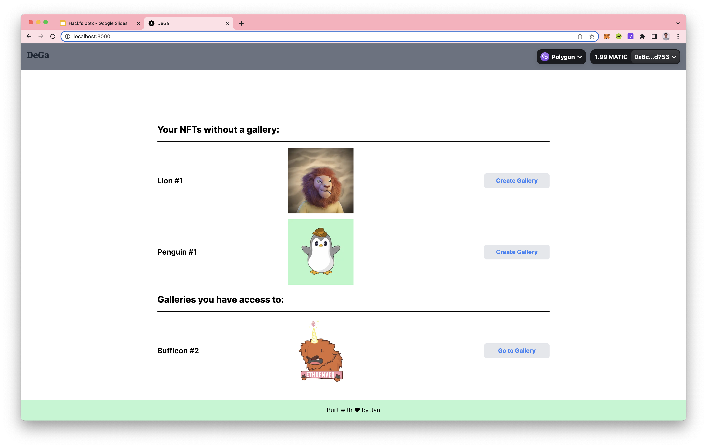
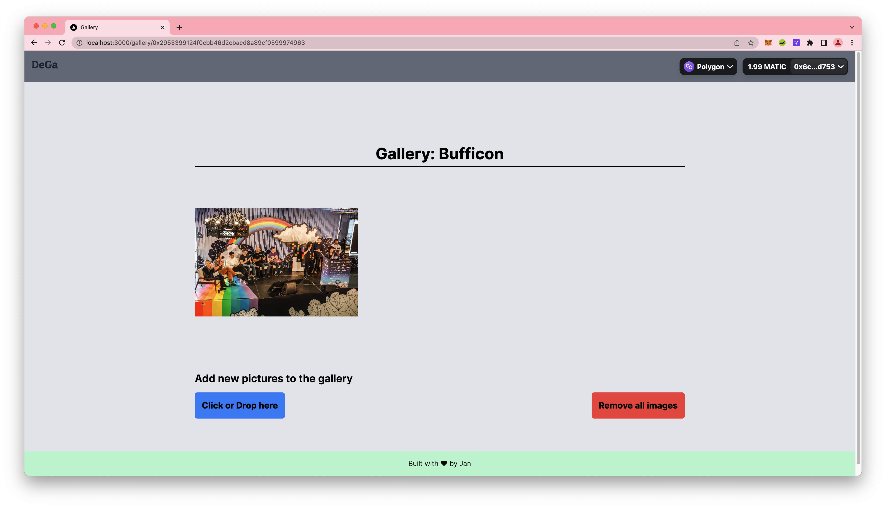

## DeGa - Decentralized Photo Gallery for NFT Communities

The times of messy photo exchanges over a mix of Telegram, Discord, Dropbox and Google Photos are over. DeGa allows NFT communities to collect photos together in a beautiful gallery. Only community members are allowed to add pictures to a gallery. The photos itself as well the access management is handled in a decentralised web3 native way.

## Learnings & Limitations

I was impressed what complex applications you can build without having your own backend or cloud functions. Developer tooling is improving quickly. A downside is that all these tools are not fully compatible yet. For example tableland is not yet supported on Polygon mainnet and NFTPort doesn't support Polygon Mumbai. Also the services are not always as stable as I wish. The tableland network/validator was down during the final stretch of the hackathon which made it impossible to debug issues or add features.

All in all, I think the ecosystem is moving in the right direction. It becomes easier and easier to build decentralised applications.

## Tech & Sponsors

-   Decentralized storage of photos: IPFS/web3.storage
-   Storage of link to photos (content identifiers): tables managed by tableland.xyz
-   Access management for photos: Policies by tableland.xyz
-   NFT ownership data: NFTPort.xyz
-   Access management data (contract events): CovalentHQ
-   Messaging for members inside a gallery (couldn't figure out how to do n:n instead of 1:1 communication): XMPT
-   Chain: Polygon (table + access management & NFT communitites live on Polygon)
